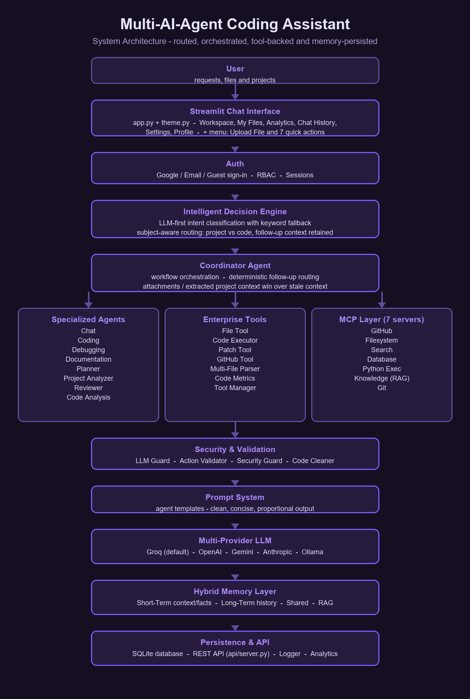

# 🤖 Multi-AI-Agent Coding Assistant

> **One workspace to chat, code, debug, document, plan and analyze** — every request is routed automatically to the right specialized AI agent by an intelligent Decision Engine.



---

## 📌 Overview

The **Multi-AI-Agent Coding Assistant** is a full-stack AI software-engineering platform built with **Python + Streamlit**. Instead of a single chat model doing everything, the system separates **decision making, workflow orchestration, task execution, tool interaction, security validation and memory** into independent, swappable components.

The platform includes:

- 🧠 **Intelligent Decision Engine** — classifies every request (LLM-first, keyword fallback)
- 🤝 **Coordinator Agent** — routes requests and orchestrates the pipeline
- 🤖 **8 Specialized AI Agents** — chat, coding, debugging, docs, planning, project analysis, review, code analysis
- 🔄 **Collaborative Workflow** — Planner → Coding → Reviewer → Code Analysis → Documentation
- 🛠 **Enterprise Tool Framework** — file ops, code execution, patching, GitHub, code metrics
- 🔌 **MCP Layer** — 7 model-context-protocol servers (GitHub, filesystem, search, database, Python exec, knowledge, git)
- 🔐 **Security & Validation** — LLM guard, action validator, security guard, code cleaner
- 💾 **Hybrid Memory** — short-term context/facts, long-term history, shared memory, RAG knowledge index
- 🗄️ **Persistence & API** — SQLite database + dependency-free REST API
- 👤 **Auth & RBAC** — Google / Email / Guest login with admin / developer / guest roles

---

## ✨ Features

### 🤖 Multi-Agent Intelligence
| Agent | Responsibility |
|---|---|
| **Chat Assistant** | General conversation, Q&A, concept explanations |
| **Coding Agent** | Generates code, creates files, implements features |
| **Debugging Agent** | Root-causes errors, explains bugs, suggests fixes |
| **Documentation Agent** | Writes docs, explains code, describes projects |
| **Planner Agent** | Breaks tasks into plans, designs architectures |
| **Project Analyzer** | Analyzes project structure, gives insights |
| **Reviewer Agent** | Critiques code for bugs and quality issues |
| **Code Analysis Agent** | Analyzes/reviews/quality-checks existing code |

### 🔄 Collaborative Workflow
Clicking **"Build an app"** runs a multi-stage graph — each agent reads the previous stage's output from shared state:

```
Planner Agent → Coding Agent → Documentation Agent
```

Compound coding-first requests ("write X, find bugs, review it, generate documentation") run the
`code_review_docs` chain:

```
Coding Agent → Code Analysis Agent → Reviewer Agent → Documentation Agent
```

Other chains: `review_project` (Project Analyzer → Reviewer), `debug_document` (Debugger →
Documentation), `explain_document` (Code Analysis → Documentation). All chains keep the same
generated code consistent from start to finish.

### 🧠 Memory & Routing Intelligence
- **Memory Store / Recall** — tell the assistant *"My name is Muskan"* and it remembers; ask *"What is my name?"* and it recalls. Personal memory stays independent of conversation context — *"forget the previous coding discussion"* clears coding context without erasing remembered facts.
- Requests route correctly even for tricky phrasing like *"Who is my favourite person?"* (recall, not store).

### 📎 File / Project Workflows
- **File upload** — a `.py`/`.txt`/`.md`/`.json`/`.csv` upload becomes conversation context: follow-ups (`analyse it`, `review it`, `convert it to Java`) act on the uploaded content, and uploaded context wins over stale conversation code.
- **ZIP project upload** — the + menu keeps a single **Upload File** action; a `.zip` uploaded through it is extracted to a per-user project folder and analyzed as a real project (structure, review, plan, README generation from the actual files — never hallucinated).

### 🤖 Model Configuration
- **Default / high-volume model:** `openai/gpt-oss-20b` (Groq) — chat, coding, debugging, documentation, routing.
- **Deep-analysis model:** `openai/gpt-oss-120b` (Groq) — planner, reviewer, code analysis, project analysis; also the automatic fallback when the primary model is rate-limited.
- The **Model Selector lives in Settings** (not the sidebar). A manual selection is persisted in the database and survives reruns/reloads; "Auto" restores the per-task split above.
- Multi-provider: Groq, OpenAI, Gemini, Anthropic and Ollama are all supported — set the matching API key in `.env` and pick the provider in Settings.

### 🔑 GitHub Token via Chat
Type `set my github token ghp_xxx` in the chat — the token is saved to `.env`, the process env, and the live MCP server instantly (no restart, no LLM call). GitHub stays hidden in the UI until you actually use a repository feature.

### 🎨 Consumer-Grade UI (theme.py + user_files.py)
- Split-panel **auth screen** with Google / Email / Guest login
- **Dark purple design system** — rounded cards, soft shadows, smooth animations (dark-only, English-only)
- Sidebar with violet active states: **🏠 Workspace · 📂 My Files · 📊 Analytics · 📜 Chat History · ⚙️ Settings · 👤 User Profile · 🚪 Logout**
- **Workspace** — the + menu offers **Upload File** plus 7 quick actions (Build Application, Write Code, Debug, Documentation, Analyze Project, Code Analysis, Chat Assistant) that **ask what you need first** instead of firing canned prompts; drag & drop uploads; rich chat with the agent label and status, Copy, Download, Regenerate and Stop
- **My Files** — private per-user upload library (never internal project folders): preview, download, rename, delete, search, filter
- **Analytics** — 5 KPI cards + 4 usage charts, every number derived from real database records
- **Chat History** — search across conversations and messages, open or export any chat
- **Legal pages** — Terms, Privacy, Help Center, What's new
- API keys and GitHub tokens are **never shown in the UI** — they stay internal

---

## 🏗️ System Architecture

```
                         User
                           │
                           ▼
                Streamlit Chat Interface (app.py + theme.py)
                           │
                           ▼
              Auth: Google / Email / Guest · RBAC · Sessions
                           │
                           ▼
                  Intelligent Decision Engine
              (Intent Detection & Task Routing)
                           │
                           ▼
                    Coordinator Agent
              (Workflow Orchestration Layer)
                           │
          ┌────────────────┼────────────────┐
          │                                │
          ▼                                ▼
 Specialized AI Agents            Enterprise Tool Framework
 (8 agents)                       (File, Executor, Patch, GitHub, …)
 + Workflow Manager               + MCP Layer (7 servers)
          │                                │
          └────────────────┬───────────────┘
                           ▼
              Security & Validation
            (LLM Guard · Action Validator · Security Guard)
                           │
                           ▼
                    Prompt System
                           │
                           ▼
              Multi-Provider LLM (Groq/OpenAI/Gemini/Anthropic/Ollama)
                           │
                           ▼
                    Hybrid Memory Layer
         (Short-Term · Long-Term · Shared · Tool History · RAG)
                           │
                           ▼
          Persistence & API (SQLite · REST API · Logger · Analytics)
```

---

## 🧩 Component Breakdown

### 🧠 Decision Engine (`agents/decision_engine.py`)
- **LLM-first classification** with a category prompt, **keyword fallback** when the LLM is unavailable.
- Handles 14 categories: `github, project, debug, documentation, planner, execution, patch, file, coding, memory_store, memory_recall, workflow, chat, code_analysis`.
- Memory fast-path: unambiguous personal statements and recall questions are detected before any LLM call.

### 🤝 Coordinator Agent (`agents/coordinator.py`)
- Receives the decision, routes to the right agent/tool, stores turns in short-term memory.
- Handlers: memory store/recall, chat, workflow, GitHub (via MCP), project analysis, code analysis, debugging, documentation, planner, patch, file, coding (+ optional execution).
- Every route logs to the execution tracker and the database.

### 🔌 MCP Layer (`mcp/`)
| Server | Capabilities |
|---|---|
| **GitHub** | repo info, branches, commits, tree, file browse, stats, issues, PRs, releases, contributors, rate limit |
| **Filesystem** | safe file read/write (path-escape protected) |
| **Search** | content search |
| **Database** | read-only queries (writes blocked) |
| **Python Exec** | sandboxed execution with error capture |
| **Knowledge** | RAG-backed knowledge retrieval |
| **Git** | local git operations |

All GitHub operations flow through `MCPManager.call("github", action, params)`.

### 🛠 Tools (`tools/`)
File Tool · Code Executor · Patch Tool · Project Analyzer · GitHub Tool · Multi-File Parser · Patch Parser · Action Validator · Execution Tracker · Code Metrics · Report Exporter · Security Guard · LLM Guard · Code Cleaner · Logger · Tool Manager

### 💾 Memory (`memory/`)
`ShortTermMemory` (context + facts) · `Memory` (long-term `history.json`) · `SharedMemory` (workflow stage handoff) · `ExecutionTracker` (`tool_execution_history.json`)

### 🗄️ Database (`database/db.py`)
SQLite (zero-config, PostgreSQL-ready) tables: users, sessions, conversations, messages, memory_facts, workflows, executions, **tool_logs** (powers the Analytics Tool Usage chart), agent_logs, analytics, github_activity, projects, settings.

### 🌐 REST API (`api/server.py`)
Dependency-free JSON API on stdlib `http.server`:
```
POST /api/login, /api/chat, /api/code, /api/debug, /api/analyze,
     /api/project, /api/github, /api/workflow
GET  /api/dashboard, /api/health
```

### 🧪 Testing
- **276 automated tests** (`pytest tests/`): coordinator routing, decision engine, LangGraph workflows, MCP, enterprise MCP, knowledge MCP, RAG (+ vector), database, API, tools, code metrics, report exporter, settings, short-term memory, model selection, memory upgrades, response directives, Google OAuth, the Streamlit UI, and follow-up/context routing.
- Run the suite with the project's virtual environment (system Python lacks the `groq` dependency):
  ```bash
  venv\Scripts\python.exe -m pytest tests/ -q     # Windows
  venv/bin/python -m pytest tests/ -q             # macOS / Linux
  ```

---

## 🚀 Getting Started

> **Environment requirement:** the application must run with its virtual-environment Python
> (`venv\Scripts\python.exe` on Windows, `venv/bin/python` on macOS/Linux). Running with system
> Python produces `No module named 'groq'` — the app reports this as a clear dependency/setup
> error with an actionable message, never as a generic AI failure.

```bash
# 1. (First time) Create the virtual environment
python -m venv venv

# 2. Install dependencies (always via the venv python)
venv\Scripts\python.exe -m pip install -r requirements.txt     # Windows
venv/bin/python -m pip install -r requirements.txt             # macOS / Linux

# 3. Configure API keys
#    Copy .env.example to .env and fill in your keys (all placeholders):
#      GROQ_API_KEY=...        (default provider)
#      OPENAI_API_KEY / GEMINI_API_KEY / ANTHROPIC_API_KEY / OLLAMA_BASE_URL (optional)
#      GITHUB_TOKEN=...        (optional, for GitHub tool)

# 4. Launch the UI
venv\Scripts\python.exe -m streamlit run app.py
# → http://localhost:8501   (default admin: admin / admin123, auto-created)

# 5. Run the CLI version
venv\Scripts\python.exe main.py

# 6. Run tests
venv\Scripts\python.exe -m pytest tests/ -q
```

**Environment configuration (`.env`)** — see `.env.example` for the full template. Never commit
`.env`; it is git-ignored and all examples ship with `<placeholder>` values only.

**Quick start in the UI:**
- Type `My name is Muskan` → stored; `What is my name?` → recalled
- Pick a **quick action** (e.g. ⚙️ Build Application) → it asks what you need, then runs
- Type `set my github token ghp_xxx` → GitHub tool becomes authenticated
- Click **⚙️ Build Application** → full 5-agent workflow, then **"Done — back to chat"**
- Upload a `.py` file, then type `analyse it` / `review it` / `generate documentation` → routed to the correct agent
- Ask `Show repo info for tensorflow/tensorflow` → GitHub via MCP

---

## 📁 Project Structure

```
├── agents/            # Decision engine, coordinator, 8 specialized agents
├── api/               # Dependency-free REST API server
├── assets/            # architecture.png (regenerate via scripts/generate_architecture.py)
├── auth/              # AuthService: hashing, sessions, RBAC, Google/Email/Guest
├── config/            # Settings service (DB-backed), provider models, env keys
├── database/          # SQLite layer (enterprise.db)
├── logsys/            # Enterprise logger
├── mcp/               # MCP manager + 7 servers (base.py, manager.py, servers/)
├── memory/            # Short-term, long-term, shared, storage, tool history
├── models/            # LLM wrapper + model manager (multi-provider)
├── prompts/           # Agent prompt templates
├── rag/               # Knowledge indexer (RAG)
├── scripts/           # generate_architecture.py, start_api.py, update_milestone4.py
├── templates/         # Agile / Defect Tracker / Unit Test Plan workbooks
├── tests/             # 276 automated tests
├── tools/             # Enterprise tool framework + security guards
├── user_files.py      # Private per-user upload library (user_data/uploads/)
├── workflow/          # WorkflowManager (5-stage collaborative pipeline)
├── app.py             # Streamlit UI (Workspace, My Files, Analytics, History, Settings, Profile)
├── theme.py           # Design system: CSS themes + HTML builders
└── main.py            # CLI entry point
```

---

## 🛠 Technologies

Python · Streamlit · SQLite · Groq / OpenAI / Gemini / Anthropic / Ollama (LLM) · Requests · MCP (Model Context Protocol) · Pillow (diagrams) · pytest · stdlib http.server (API) · PBKDF2-SHA256 (auth)

---

## 📋 Project Templates

The `templates/` folder ships filled agile workbooks tracking the whole project:

- **Agile_Template_Filled.xlsx** — Product Backlog, Sprint Backlog (with day grids), Stand-up Meeting, Retrospection — Sprints 1–4
- **Defect_Tracker_Filled.xlsx** — every bug found and fixed, by sprint
- **Unit_Test_Plan_Filled.xlsx** — test cases TC-001…TC-043

Sprint 4 rows reflect the current state of the product (Google Sign-In, intent-based routing with follow-up context, uploaded project ZIP analysis, clean agent output, UI polish, and the 276-test regression suite). Sprints 1–3 document the original milestones (agents, tools, consumer UI). Sprint data can be extended idempotently with `scripts/update_milestone4.py`.

---

## ⚠️ Known Limitations

- **Groq free-tier rate limits.** The default provider's free tier caps tokens per minute. Heavy
  multi-stage workflows (a full "build → review → debug → document" chain) can exceed the
  per-minute budget. The app handles this gracefully: a user-friendly rate-limit message, a
  one-shot retry on the alternate model, and no endless retries or quota-burning loops. If a
  workflow is blocked by the external limit it is recorded as *Blocked by external rate limit*,
  not as an application failure — retrying after the quota window resets usually succeeds.

---

## ✅ Conclusion

The **Multi-AI-Agent Coding Assistant** (v2.1.0) demonstrates a production-style multi-agent architecture: an intelligent Decision Engine routes requests to specialized agents, a Coordinator orchestrates them, a collaborative Workflow chains agents together, enterprise tools + MCP servers enable real operations, a hybrid memory + database layer persists everything, output constraints (exact word counts, "only code" responses) and tool-instruction hygiene (no PATCH/FILE leaks into user-visible output) are enforced programmatically — validated by **276 automated tests**.
